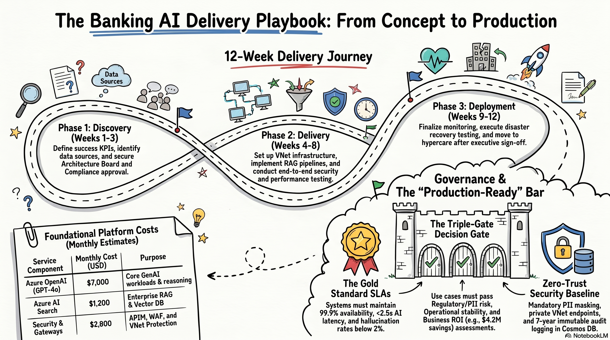

# AI Playbook for the Tier 1 Enterprise — Documentation Hub

> **Central reference for the AI Platform program** — A concise enterprise playbook for delivering Generative AI in regulated banking, aligned to CBUAE and UAE PDPL requirements.
>
> This hub centralizes governance, architecture, delivery, and operational readiness documentation for regulated banking AI.

---

## What this hub is for

- Aligns governance, architecture, operational readiness, and business value across the AI program.
- Makes decision points traceable from initial use-case approval through release, monitoring, and future upgrades.
- Provides role-based entry points so delivery, engineering, compliance, and executive teams can find the most relevant artifact quickly.

---

## 📚 Document Index

This index is the central navigation point for the AI delivery playbook. Use it to quickly find the right artifact for governance, architecture, delivery, or program alignment.

| # | Document | Primary Purpose | Core Focus |
|---|----------|-----------------|------------|
| **01** | [1-delivery-decision-framework.md](./1-delivery-decision-framework.md) | Approve and gate new AI use cases | Risk posture, compliance, explainability, readiness |
| **02** | [2-production-readiness-checklist.md](./2-production-readiness-checklist.md) | Validate production readiness | Operations, AI reliability, security, SLAs |
| **03** | [3-delivery-technology-choice-matrix.md](./3-delivery-technology-choice-matrix.md) | Select Azure services and architecture patterns | Identity, AI, data, security, FinOps |
| **04** | [4-delivery-timeline-plan.md](./4-delivery-timeline-plan.md) | Execute the 12-week delivery plan | Milestones, owners, dependencies, status |
| **05** | [5-ai-platform-roadmap.md](./5-ai-platform-roadmap.md) | Align the 12-month AI program | Foundation, platform build, use-case delivery, scale |
| **06** | [6-rm-assistant-project.md](./6-rm-assistant-project.md) | Reference flagship use case architecture | RM assistant, RAG, CRM, banking advisory |
| **07** | [7-new-frontier-rollout-plan.md](./7-new-frontier-rollout-plan.md) | Plan safe model upgrades | GPT migration, shadow testing, guardrails |
| **08** | [8-platform-kpi-target.md](./8-platform-kpi-target.md) | Track platform KPIs and value metrics | Infrastructure, application, AI, business outcomes |
| **09** | [9-enterprise-layered-design.md](./9-enterprise-layered-design.md) | Define layered platform architecture | API, orchestration, knowledge, model, security, observability |
| **10** | [10-comprehensive-ai-delivery-framework.md](./10-comprehensive-ai-delivery-framework.md) | Master program framework | Initiatives, budget, governance, RAID, backlog |

---

## 🔗 How the documents connect

### Decision to execution

- **01 Decision Framework** defines governance gates and approval criteria.
- **02 Production Readiness** validates operational, AI, and security readiness before launch.
- **08 KPI Targets** maps business value and health metrics to approved use cases.
- **09 Layered Design** and **05 Roadmap** translate approved decisions into architecture and delivery milestones.

### Strategy to architecture

- **05 Roadmap** sets the 12-month direction.
- **03 Tech Matrix** grounds the roadmap in Azure service choices.
- **06 RM Assistant** illustrates the flagship use case architecture and integration pattern.
- **07 GPT Rollout** ensures model upgrades fit into the platform’s lifecycle.

### Architecture to implementation

- **09 Layered Design** defines the core platform layers.
- **03 Tech Matrix** maps those layers to Azure services.
- **02 Production Readiness** confirms the implementation is secure, stable, and observable.
- **04 Timeline** locks in the delivery cadence.

---

## 📋 Quick reference

### 01 — Delivery Decision Framework
> Use when evaluating a proposed AI use case. Focus: regulatory risk, data/classification, explainability, operational controls, and business value.

### 02 — Production Readiness Checklist
> Use when preparing for release. Focus: readiness sign-off across operations, AI reliability, security controls, and SLA adherence.

### 03 — Technology Choice Matrix
> Use when selecting Azure services. Focus: capability fit, service tradeoffs, and enterprise deployment patterns.

### 04 — Delivery Timeline Plan
> Use when planning execution. Focus: weekly deliverables, ownership, and status visibility.

### 05 — AI Platform Roadmap
> Use when aligning the 12-month program. Focus: phased platform build, use case delivery, and scaling strategy.

### 06 — RM Assistant Project
> Use as a flagship reference use case. Focus: banking advisory, RAG, CRM integration, and grounded AI delivery.

### 07 — GPT Rollout Plan
> Use when planning a model upgrade. Focus: compliance, shadow testing, alignment, and canary rollout.

### 08 — Platform KPI Targets
> Use when measuring health and value. Focus: infrastructure, application, AI, and business outcomes.

### 09 — Enterprise Layered Design
> Use for architecture review. Focus: enterprise-grade zero-trust platform design with observability baked in.

### 10 — Comprehensive Framework
> Use for governance and executive alignment. Focus: program budget, backlog, RAID, and initiative tracking.

---

## 🎯 Recommended entry points

| Role | First document | Follow-up |
|------|----------------|-----------|
| AI Delivery Lead | 10 → 05 | 01, 04, 08, 09 |
| Platform Engineer | 09 → 03 | 02, 04, 05 |
| Solution Architect | 06 → 09 | 01, 03, 07 |
| Compliance / Risk | 01 → 10 | 02, 07, 09 Security |
| Engineering Manager | 04 → 05 | 02, 08, 10 |
| Executive Sponsor | 10 → 05 | 01, 08 |

---

## 📐 Conventions

| Marker | Meaning |
|--------|---------|
| `In Progress` / `Not Started` / `Done` | Execution tracking |
| `Green` / `Amber` / `Red` | KPI or risk status |
| `PASS` / `APPROVE` / `HIGH VALUE` | Decision gate outcomes |
| `DONE` / `PENDING` | Readiness checklist status |
| `Foundation` / `Platform` / `Scale` | Roadmap phase horizons |
| `API` / `Orchestration` / `Knowledge` / `Model` / `Security` / `Observability` | Architecture domains |

---

## 🔐 Compliance baseline

This playbook targets enterprise-grade regulated banking deployments with:

- **CBUAE alignment** for model risk and data residency
- **UAE PDPL compliance** for personal data protection
- **Azure Landing Zone best practices** for scale and governance
- **Zero-trust architecture patterns** with private connectivity and managed identity
- **Audit retention** via immutable, centralized logging

---

## 📁 Source files

This folder contains Markdown exports of the underlying Excel workbook artifacts.

---

## 🔄 Maintenance guidance

- New use-case approval: update **01**, then reflect in **05** and **10**.
- Architecture change: update **09**, then align **03** and **10**.
- KPI drift: log in **08**, add a RAID item in **10**, and update **02** as needed.
- Model upgrade: follow **07**, then update **09** model layer artifacts.
- Release candidate: execute **02**, gate via **01**, deploy per **04**.

---

## 📞 Ownership

- Program Delivery: AI Delivery Lead
- Platform Engineering: Platform Team Lead
- AI/ML Engineering: AI Engineering Lead
- Security & Compliance: CISO / Risk Committee
- Business Stakeholders: CIO / Business Sponsors

> **Last Updated:** June 2026  
> **Version:** 1.0 — Baseline Documentation Set  
> **Classification:** Internal — Confidential (Banking IP)

## 📞 About

Prepared by Seyhun Akyurek - 2026